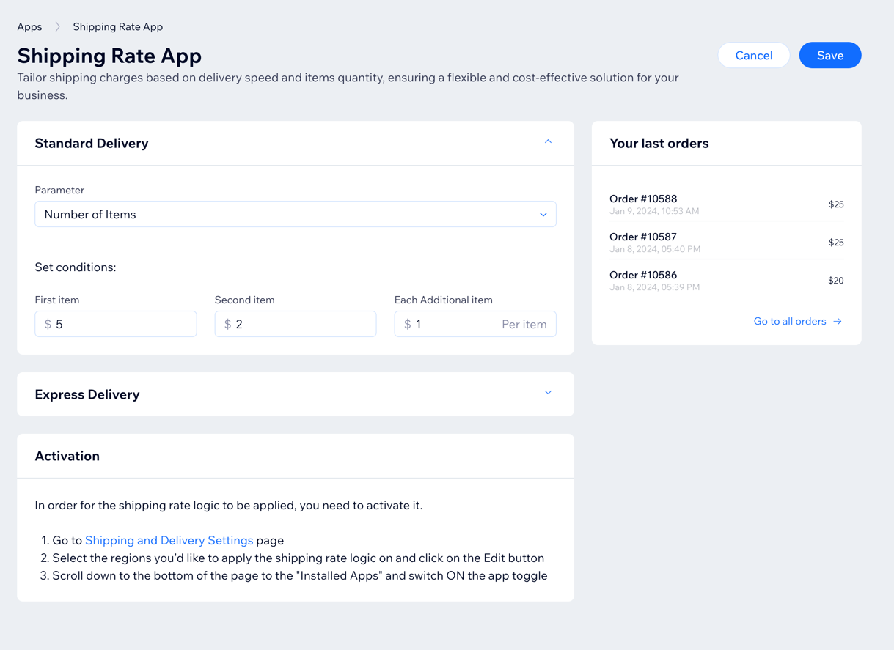
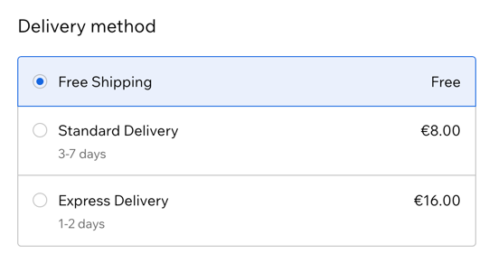

This is a [Next.js](https://nextjs.org/) project bootstrapped with [`create-next-app`](https://github.com/vercel/next.js/tree/canary/packages/create-next-app).
Aimed to provide an example Shipping Fulfillment App for [Wix App Market](https://dev.wix.com/docs/build-apps).


## Getting Started

The application requires the following environment variables to be set:
* `WIX_APP_ID` - The application ID in Wix Development Center (The application you created in Wix Development Center)
* `WIX_APP_SECRET` - The application secret in Wix Development Center, as described in the [Ouath flow documentation](https://dev.wix.com/docs/build-apps/build-your-app/authentication/oauth#step-4-app-requests-the-authorization-code)
* `WIX_APP_JWT_KEY` - Your application webhooks public key, as described in the [Webhooks documentation](https://dev.wix.com/docs/build-apps/developer-tools/apis-and-webhooks/webhooks#register-for-webhooks)

For local development, these variables should be set in the `.env.local` file, which is not committed to source control.
Also, they are all server side variables, your public key and secret should not be exposed to the client.<br>
You can use [`.env.template`](./.env.template) as a template.<br>
When deploying to production, these variables should be set as environment variables according to the hosting platform guidelines, for example:
* [Netlify](https://docs.netlify.com/environment-variables/overview/)
* [Vercel](https://vercel.com/docs/environment-variables)

### Running the application locally
By default, the applications uses npm, but you can use yarn or pnpm as well.<br>
To install dependencies:
```bash
npm install
# or
yarn
# or
pnpm install
```

To run the development server:
```bash
npm run dev
# or
yarn dev
# or
pnpm dev
```

Open [https://localhost:3000/dashboard](https://localhost:3000/dashboard) with your browser to see the result.

In order to test an actual integration with the backend systems, use one of the following methods:
* Change the urls in the dev center to point to https://localhost:3000/
* Debug the application in the actual dashboard and copy the access token sent to provided to it by the dashboard sdk page and pass it as a query parameter `accessToken`
  * This will set it as an `Authorization` header in the requests to the backend systems.
  * See - [`middleware.ts`](./src/middleware.ts) for more details
* Use a tool/plugin (i.e. Chrome plugin or `hosts` file on MacOS) to proxy calls from your deployment server to your local server in your browser so opening the dashboard page in Wix business manager will actually route the calls to your local server.


## Features
### Dashboard page

  Pre-integrated with [Wix Design System](https://www.wixdesignsystem.com/) and [Wix Dashboard SDK](https://dev.wix.com/docs/sdk/api-reference/dashboard/introduction)
* Including SSR support
  * Server components are not yet supported by Wix Design System, but SSR is supported.
* Provides a simple dashboard page with navigations to relevant pages and a simple example of a shipping delivery form
* Integrates with [Wix Data API](https://dev.wix.com/docs/sdk/api-reference/data/items/query-data-items) to query last orders and present last 3 orders in the dashboard

**Note**: This example dashboard implementation does not include the actual persistence of the model to an actual DB

#### Development Entry point
1. [`dashboard/page.tsx`](./src/app/dashboard/page.tsx)
   * The page uses the sample app model implementation in [`app-data.model.ts`](./src/app/types/app-data.model.ts). It provides an array of shipping delivery methods, which can be extended to your needs
   * The dashboard page uses both the client side SDK implementation [`wix-sdk.client.ts`](./src/app/utils/wix-sdk.client.ts) and server side - [`wix-sdk.ssr.ts`](./src/app/utils/wix-sdk.ssr.ts) for SSR support.

### Delivery method SPI implementation

* [Wix Checkout Delivery method SPI](https://dev.wix.com/docs/rest/api-reference/wix-e-commerce/shipping-rates-integration-spi/introduction) is used to provide a custom delivery methods for Wix checkout

#### Development Entry point
1. [`/api/shipping-rates/v1/getRates/`(route.ts)](./src/app/api/shipping-rates/v1/getRates/route.ts)
* Provides a simple implementation of a shipping delivery method, which can be extended to your needs. 
* The provided implementation receives the ordered items, their weight and quantity, and returns a list of delivery methods with their price and estimated delivery time
  * If the calculation of the delivery method is by weight, the implementation checks the unit of the weight, and converts it from KG to LB or vice versa if needed.

### Oauth
* Oauth integration with Wix using [Wix Apps OAuth API](https://dev.wix.com/docs/build-apps/build-your-app/authentication/oauth)
* Exchange authorization code for access token
* Get App instance information using the access token using [Get app instance API](https://dev.wix.com/docs/rest/api-reference/app-management/apps/app-instance/get-app-instance)

#### Development Entry points
1. [`/api/oauth/v1/authorize/`(route.ts)](./src/app/api/oauth/v1/authorize/route.ts)
   * Implements the [installation URL](https://dev.wix.com/docs/build-apps/build-your-app/authentication/oauth#step-1-user-installs-your-app) in Wix App Oauth flow, which defines some state and redirects to Wix App Oauth URL, including the redirect URL to the callback endpoint in the application.<br>
2. [`/api/oauth/v1/signup/`(route.ts)](./src/app/api/oauth/v1/signup/route.ts)
   * Implements the [redirect URL](https://dev.wix.com/docs/build-apps/build-your-app/authentication/oauth#step-3-wix-redirects-user-to-apps-redirecturl) which received the authorization code and exchanges it for an access token and invokes [Get app instance API](https://dev.wix.com/docs/rest/api-reference/app-management/apps/app-instance/get-app-instance) using it.

### Webhooks
* Webhooks support using [Wix Apps Webhooks API](https://dev.wix.com/docs/build-apps/developer-tools/apis-and-webhooks/webhooks)
* Parse JWT token from Wix using app secret and verify signature
* Example "App Installed" and "App Removed" webhooks

#### Development Entry points
1. [`/api/webhooks/v1/install/`(route.ts)](./src/app/api/webhooks/v1/install/route.ts)
    * Parse the JWT token from Wix using app secret and verify signature, allowing you to add your logic to handle the "App Installed" webhook
2. [`/api/webhooks/v1/uninstall/`(route.ts)](./src/app/api/webhooks/v1/uninstall/route.ts)
    * Parse the JWT token from Wix using app secret and verify signature, allowing you to add your logic to handle the "App Installed" webhook


## Learn More

To learn more about Next.js, take a look at the following resources:

- [Next.js Documentation](https://nextjs.org/docs) - learn about Next.js features and API.
- [Learn Next.js](https://nextjs.org/learn) - an interactive Next.js tutorial.

You can check out [the Next.js GitHub repository](https://github.com/vercel/next.js/) - your feedback and contributions are welcome!

## Deployment

This template is written in [Next.js](https://nextjs.org/docs) 14 using [Next.js app router](https://nextjs.org/docs/app). To learn more about `Next.js`, see the following resources:

+ [Next.js documentation](https://nextjs.org/docs): Learn about Next.js features and APIs.
+ [Learn Next.js](https://nextjs.org/learn): An interactive Next.js tutorial.
+ [Next.js app router](https://nextjs.org/docs/app): Information on the Next.js App Router Roadmap.

### One click deployment to Netlify or Vercel

##### Netlify

[](https://app.netlify.com/start/deploy?repository=https://github.com/wix/app-template-custom-shipping-rates)

For more information, see [How to Deploy Next.js Sites to Netlify](https://www.netlify.com/blog/2020/11/30/how-to-deploy-next.js-sites-to-netlify/).

---

##### Vercel

[](https://vercel.com/new/clone?s=https://github.com/wix/app-template-custom-shipping-rates)

For more information, see [How to Deploy Next.js Sites to Vercel](https://vercel.com/docs/frameworks/nextjs)
