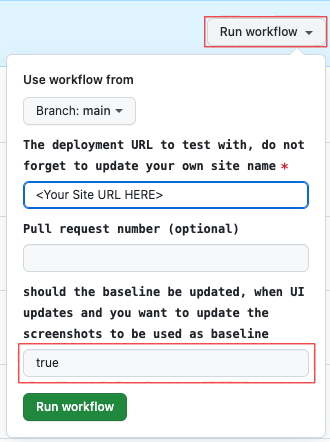

# Wix Self-Hosted App Template: Custom Shipping Rates

The Custom Shipping Rates app template is part of the [Wix app templates collection](https://dev.wix.com/apps-templates).

This [Next.js 14](https://nextjs.org/) template demos a simple shipping solution, is fully customizable and sets a foundation for developing self-hosted Wix apps. It takes care of webhooks and OAuth, implements a Wix SPI and features a pre-built dashboard page, designed with the Wix Design System and built with the Wix Dashboard SDK.

The template handles common app functionalities, laying the groundwork for further customization and development.


## About Wix app templates

[Wix apps](https://dev.wix.com/docs/build-apps) enhance the functionality of Wix sites by adding new features such as custom pages, dashboard components, third-party integrations, or site analytics. Starting with an app template fast-tracks the development process, providing a working foundational app that developers can modify and build upon. This approach saves valuable time, allowing for a quick transition from concept to a fully functional app.

Learn more about [Wix app templates](https://dev.wix.com/docs/build-apps/developer-tools/templates-and-examples/get-started-from-an-app-template) and explore our growing [template collection](https://dev.wix.com/apps-templates).


## Template features

This Wix app template incorporates the following features:

+ **Self-hosting:** Develop and host an app on any platform, and integrate with Wix using the Wix Dev Center.
+ **OAuth:** Secure authentication flow following Wix's guidelines.
+ **Wix Design System:** Utilize Wix's reusable React components for a cohesive user experience consistent with Wix's design standards.
+ **Wix Dashboard SDK:** Integrate custom dashboard components with the Wix site dashboard.
+ **Shipping Rates SPI:** Integrate custom logic for calculating shipping rates.
+ **Webhooks:** Handle app lifecycle events.


## Prerequisites

Before getting started, make sure you have the following set up:

+ [Node.js](https://nodejs.org/en/) (v18.16.0 or higher).
+ A [Wix developer account](https://users.wix.com/signin?loginDialogContext=signup&referralInfo=HEADER&postLogin=https:%2F%2Fdev.wix.com%2Fdc3%2Fmy-apps&postSignUp=https:%2F%2Fdev.wix.com%2Fdc3%2Fmy-apps&forceRender=true).


## Deploy to a free hosting service

This template supports [quick deployment on Vercel or Netlify](https://dev.wix.com/apps-templates/template?id=644fdc01-0c0f-4a7e-ae56-3b3a7875a67c) so you can get your app up and running in minutes. With quick deployment, you can:

+ Clone the app template repo and deploy a live app server instantly.
+ Generate a pre-configured app in the [Wix Dev Center](https://dev.wix.com/docs/build-apps/developer-tools/developers-center/get-started-with-the-wix-developers-center). For configuration details, read about [what deployment gives you](#what-deployment-gives-you).

For instructions, go to the [app template page](https://dev.wix.com/apps-templates/template?id=644fdc01-0c0f-4a7e-ae56-3b3a7875a67c).


## Deployment on a different platform

To deploy the template on any other platform, follow these steps:


### Step 1 | Deploy the app's server code

Follow your platform's instructions to clone the repo and deploy the app server, then find and copy the deployment domain. This is the base URL for your app's server.


### Step 2 | Generate a pre-configured Wix Dev Center app

To generate an app in the [Wix Dev Center](https://dev.wix.com/docs/build-apps/developer-tools/developers-center/get-started-with-the-wix-developers-center) and pre-configure it automatically for the template:

1. On the template page, click **Use Template**.

1. Under **Select your hosting service**, select **Deploy somewhere else** and click **Continue**.

1. Under **Add your base URL**, enter your deployment's base URL.

1. Under **App name**, enter a name for your app. For example: "Custom Shipping Rates".

1. Click **Create & Continue**.

This creates an app for you in the Wix Dev Center with the required URLs and permissions pre-configured.


### Step 3 | Configure environment variables

Once your app is created, a screen appears with a code snippet containing environment variables you need to save in your app code:

+ `WIX_APP_ID`: Your app's Wix App ID.
+ `WIX_APP_SECRET`: Your app's secret key.
+ `WIX_APP_JWT_KEY`: Your app's public key.

Save these environment variables as follows:

1. Click **copy** to copy the code snippet to the clipboard.

1. Create a file in your production root folder called `.env`, paste the code snippet into the file and save it.

    **Note:** Always keep your `.env` secure and never commit it to version control. This file contains sensitive keys that should not be exposed publicly.

1. Redeploy the app.

When deployment is finished, your app is ready to install.


### Step 4 | Test the app

Follow these steps to create a [development site](https://dev.wix.com/docs/build-apps/developer-tools/cli/workflow/development-sites), install your app on the site, and try it out.

1. In your app's page in the [Wix Dev Center](https://dev.wix.com/apps), click **Test Your App** in the top right, then click **Create Development Site**.

1. In the list of business solutions to install on the development site, click **Wix Stores**, then click **Create Site**.

1. Back in your app's page in the Wix Developers Center, click **Test Your App**, then click **App Market Website**.

1. Click **Add to Site**.

1. Click **Select** next to the development site you just created.

1. Wix now requests the site permissions your app requires. Click **Agree & Add** to install the app.

Your app is now installed on your development site. To see the app's dashboard page, click **Apps** in the site dashboard's left sidebar, then click **Custom Shipping Rates**.


## What deployment gives you

When you deploy this template, an app is automatically created for you in the [Wix Dev Center](https://dev.wix.com/apps/my-apps), pre-configured with settings required for the app to function properly within the Wix ecosystem. Find these pre-configured settings later in the app's dashboard as follows:

+ **OAuth page:** App URL and Redirect URL for the [app OAuth flow](https://dev.wix.com/docs/build-apps/build-your-app/authentication/oauth).

+ **Webhooks page:** App Removed and App Installed [webhooks](https://dev.wix.com/docs/build-apps/build-your-app/authentication/authentication-overview#webhooks).

+ **Extensions page:** Dashboard Page extension for the [dashboard page](https://dev.wix.com/docs/build-apps/developer-tools/extensions/dashboard-page#create-a-dashboard-page) and eCom Shipping Rates extension for [integrating with the Shipping Rates SPI](https://dev.wix.com/docs/rest/api-reference/wix-e-commerce/shipping-rates-integration-spi/introduction).

+ **Permissions page:** [Permission scopes](https://dev.wix.com/docs/build-apps/build-your-app/authentication/permissions) required for the APIs that the app calls.

When your server is deployed you can also preview the app's site dashboard page UI by navigating in the browser to `<YOUR_BASE_URL>/dashboard`.


## Local deployment

While developing your app, you may also wish to deploy and test it locally. You can do this as follows:

1. Clone your version of the app repo locally:

    ```shell
    git clone <YOUR_REPO>
    ```

1. Make sure you are in the repo's root folder, then install dependencies:

    ```shell
    npm install
    ```

1. Create a file called `.env.local` in the repo's root folder. In that file, paste the required environment variables that you copied during quick deployment.

    If you didn't copy these values during quick deployment, you can retrieve them in the [Wix Dev Center](https://dev.wix.com/apps), then paste them in the following format:

    ```env
    # App ID and App Secret Key: Retrieve from the OAuth page in the app's dashboard in the Wix Dev Center.
    APP_ID=<APP_ID>
    APP_SECRET=<APP_SECRET KEY>

    # App Public Key: Retrieve from the Webhooks page in the app's dashboard in the Wix Dev Center.
    WEBHOOK_PUBLIC_KEY="<APP_WEBHOOK_PUBLIC_KEY>"
    ```

    **Note:** Always keep your `.env.local` secure and never commit it to version control. This file contains sensitive keys that should not be exposed publicly.

1. For the URLs configured in the Wix Dev Center, replace the app's base URL with `https://localhost:3000/`:

   + **OAuth page:** App URL and Redirect URL for the [app OAuth flow](https://dev.wix.com/docs/build-apps/build-your-app/authentication/oauth).

   + **Webhooks page:** App Removed and App Installed [webhooks](https://dev.wix.com/docs/build-apps/build-your-app/authentication/authentication-overview#webhooks).

1. To start the development server, enter:

    ```shell
    npm run dev
    ```

You can now install the app on a Wix site with server code running locally.

> **Note:** Remember to revert to the deployment URLs in the Wix Dev Center when you are ready to switch your app to production server deployment. You'll need to reinstall the app for the change to take effect.


## Extend and customize the app

The template is designed for easy customization and extension. Here are some suggested entry points where you can add your own custom logic or functionality:


### Dashboard page customization

The dashboard page is pre-integrated with the [Wix Design System](https://www.wixdesignsystem.com/) and [Wix Dashboard SDK](https://dev.wix.com/docs/sdk/api-reference/dashboard/introduction), providing a simple user interface that includes support for server-side rendering. It includes navigation to other relevant pages and an example of a shipping delivery form, and it utilizes the [Wix Data API](https://dev.wix.com/docs/sdk/api-reference/data/items/query-data-items) to query and present the last three orders in the dashboard. It utilizes both [client-side](./src/app/utils/wix-sdk.client-only.ts) and [server-side](./src/app/utils/wix-sdk.ts)(can be used from the client too, but would increase bundle size) SDK implementations.

Customize the dashboard page to fit your specific needs, whether it's updating the UI or adding new features.

**Development entry point:** [`src/app/dashboard/page.tsx`](./src/app/dashboard/page.tsx)

This file contains the parent component for the dashboard interface. The interface uses the app model defined in [`src/app/types/app-data.model.ts`](./src/app/types/app-data.model.ts) to provide an array of shipping delivery methods. It's a prime location for extending the dashboard functionality or integrating additional services.

#### Server actions support

[Server actions](https://nextjs.org/docs/app/building-your-application/data-fetching/server-actions-and-mutations) were introduced in Next 13.5, and are a great way to handle server logic in a Next.js app.
This template was created with server actions in mind, and the dashboard page is a great place to start using them.
Since not all deployment providers support server actions, the template is set up **not** to use server actions by default.
In order to use server actions, just uncomment `// 'use server';` at the top of [`src/app/actions/app-data.ts`](./src/app/actions/app-data.ts) and [`src/app/actions/orders.ts`](./src/app/actions/orders.ts) and redeploy the app.

### Integrate the app with an external database

This template does not include database persistence. Instead, it's designed to be easily integrated with your choice of database solutions for storing app data.

**Development entry point:** [`src/app/actions/app-data.ts`](./src/app/actions/app-data.ts)

This file contains shell functions you can extend with functionality for saving and retrieving data using an external database.


### Shipping Rates SPI implementation

The app leverages the [Wix eCommerce Shipping Rates SPI](https://dev.wix.com/docs/rest/api-reference/wix-e-commerce/shipping-rates-integration-spi/introduction) to incorporate a basic shipping rate customization functionality based on item weight or quantity. This implementation provides a flexible framework that you can extend to provide more tailored shipping options.

**Development entry point:** [`src/app/api/shipping-rates/v1/getRates/route.ts`](./src/app/api/shipping-rates/v1/getRates/route.ts)

This endpoint is crucial for customizing the logic used to calculate shipping rates. The implementation can be extended or refined to accommodate different logistics models, alternative calculation criteria, or integration with third-party shipping APIs.


### Webhooks support

The template implements support for two app lifecycle [webhooks](https://dev.wix.com/docs/build-apps/developer-tools/apis-and-webhooks/webhooks).

**Development entry points:**
+ [`src/app/api/webhooks/v1/install/route.ts`](./src/app/api/webhooks/v1/install/route.ts) receives a payload when the app is installed.
+ [`src/app/api/webhooks/v1/uninstall/route.ts`](./src/app/api/webhooks/v1/uninstall/route.ts) receives a payload when the app is removed.

In these files, you can extend the logic that is triggered when the app is installed or uninstalled. For example: add custom cleanup logic, notification systems, or integration with external services upon app installation or removal.

You can also add routes to support additional webhooks, basing your implementation on the patterns modelled here.

## Managing the app's lifecycle

### Package dependency management

To ensure this repo always uses the latest APIs from the Wix JavaScript SDK, the repo is preconfigured with [Dependabot](https://docs.github.com/en/code-security/dependabot), GitHub's automated dependency management system. Due to the numerous pull requests generated by Dependabot, the repo also includes a preconfigured GitHub Action called "Combine PRs." This action can be executed manually to merge all of Dependabot's pull requests into a single PR, allowing for sanity checks to be performed only once. If the sanity check fails, each Dependabot PR can be inspected individually.

### Testing

This repo is preconfigured with [Playwright](https://playwright.dev/) for both functional and UI (screenshot) testing.
It contains GitHub Actions for PRs for both [Netlify](./.github/workflows/netlify-e2e.yml) and [Vercel](./.github/workflows/vercel-e2e.yml).

You may remove the configuration not in use.

> **Notes:**
> + The end-to-end actions depend on the site name. Please update the site name in the [CI configuration file](./ci.config.json) for the relevant platform.
> + Some deployment platforms don't copy workflows to the cloned repo. If the `.github/workflows` directory is empty, copy the necessary file from the [template repo](https://github.com/wix/app-template-custom-shipping-rates) to your repo.


#### Screenshot testing

This repo includes screenshots for validating the initial site setup provided. Any changes you make may render these tests invalid.
To update the screenshots, trigger the workflow manually, and set the `shouldUpdateBaseline` workflow input to `true`. Remember to execute this on the applicable deployment platform/s.



## Learn more

For more information:

+ Learn more about [Wix app templates](https://dev.wix.com/docs/build-apps/developer-tools/templates-and-examples/get-started-from-an-app-template).
+ Check out our [full collection of app templates](https://dev.wix.com/apps-templates).
+ See our documentation for details about [building Wix apps](https://dev.wix.com/docs/build-apps).
